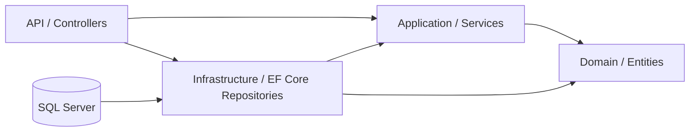

# Library Management API

[](https://github.com/Rakib-Ahasan/Library-Management/actions/workflows/ci.yml)

A Clean Architecture library management API built with .NET 10, ASP.NET Core, EF Core, SQL Server, FluentValidation, AutoMapper, and a service-oriented application layer.

## Prerequisites

- [.NET 10 SDK](https://dotnet.microsoft.com/download/dotnet/10.0) (required)
- SQL Server or LocalDB
- EF Core CLI tools: `dotnet tool install --global dotnet-ef`

## Architecture



## Tech stack

-  ASP.NET Core Web API
- Entity Framework Core 10 and SQL Server
- FluentValidation
- AutoMapper
- Serilog
- xUnit, Moq, and FluentAssertions

## Folder structure

```text
src/
  LibraryManagement.Domain/          Entities and domain exceptions
  LibraryManagement.Application/    DTOs, validators, services, and contracts
  LibraryManagement.Infrastructure/ EF Core context and repositories
  LibraryManagement.Api/             Controllers, middleware, and composition root
tests/
  LibraryManagement.Tests/           Unit tests
docs/                                API client assets
```

## Setup

```powershell
dotnet restore
dotnet ef migrations add InitialCreate --project src/LibraryManagement.Infrastructure --startup-project src/LibraryManagement.Api
dotnet ef database update --project src/LibraryManagement.Infrastructure --startup-project src/LibraryManagement.Api
dotnet run --project src/LibraryManagement.Api
```

The API is available under `https://localhost:5001` or the URL printed by `dotnet run`. Swagger is enabled in Development.

## API endpoints

| Method | Route | Description | Status codes |
|---|---|---|---|
| GET | `/api/v1/books` | List books with paging/search | 200 |
| GET | `/api/v1/books/{id}` | Get a book | 200, 404 |
| POST | `/api/v1/books` | Create a book | 201, 409, 422 |
| PUT | `/api/v1/books/{id}` | Update a book | 204, 404, 409, 422 |
| DELETE | `/api/v1/books/{id}` | Delete a book | 204, 400, 404 |
| GET | `/api/v1/members` | List members | 200 |
| POST | `/api/v1/members` | Create a member | 201, 409, 422 |
| GET | `/api/v1/loans?activeOnly=true` | List loans | 200 |
| POST | `/api/v1/loans/borrow` | Borrow a book | 201, 400, 404, 422 |
| POST | `/api/v1/loans/{id}/return` | Return a loan | 200, 400, 404 |
| GET | `/api/v1/loans/overdue` | List overdue loans | 200 |

## Sample requests

```bash
curl "https://localhost:5001/api/v1/books?page=1&pageSize=10&search=clean"
```

```bash
curl -X POST "https://localhost:5001/api/v1/loans/borrow" \
  -H "Content-Type: application/json" \
  -d '{"bookId":1,"memberId":1,"days":14}'
```

## Design decisions

- Repository and unit-of-work abstractions isolate EF Core from the application layer.
- Domain methods such as `TakeCopy`, `ReturnCopy`, and `MarkReturned` keep business invariants inside entities.
- The service pattern keeps controllers thin without adding MediatR or CQRS overhead.
- .NET 10 provides the current platform, compiler, and ASP.NET Core APIs targeted by this solution.

## Assumptions

- The default loan period is 14 days.
- A member may have at most 5 active loans.
- Fine calculation is not implemented.

## Author

- **Md. Rakib Ahasan**
- LinkedIn: https://www.linkedin.com/in/rakib-ahasan
- GitHub: https://github.com/Rakib-Ahasan
- Email: bd.rakibahasan@gmail.com
